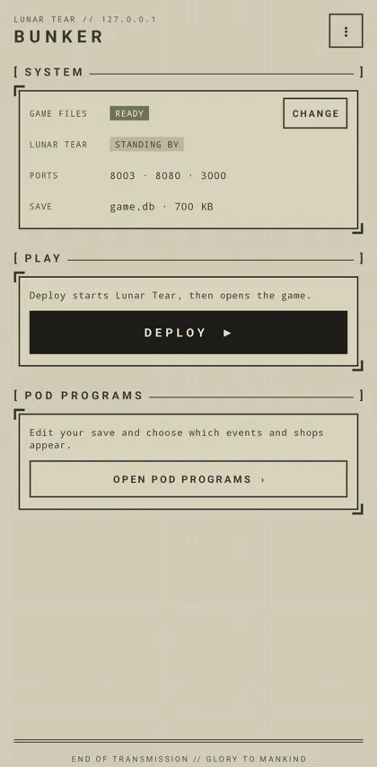
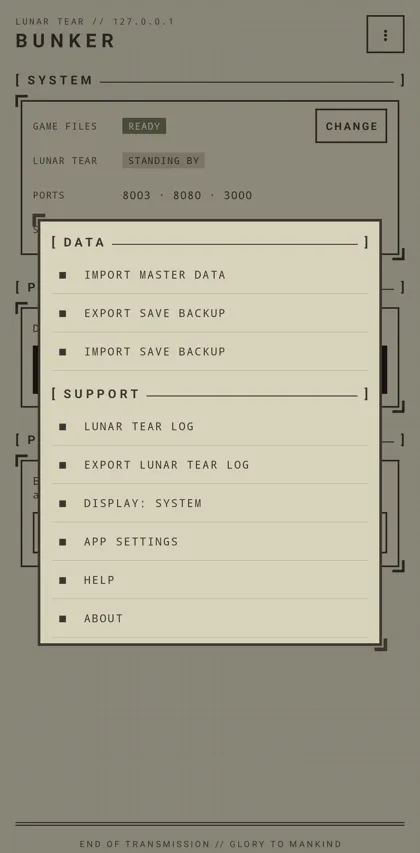
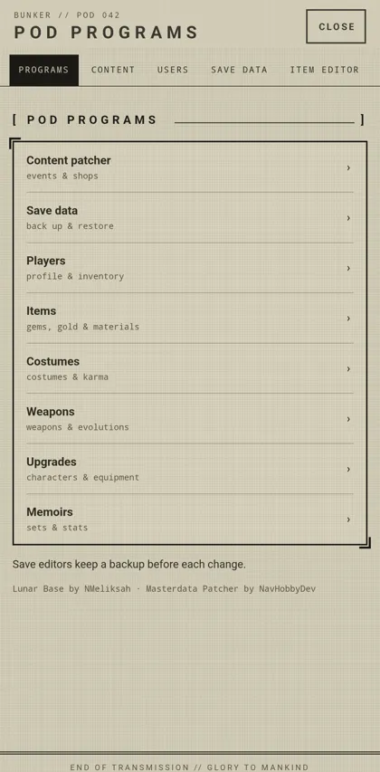
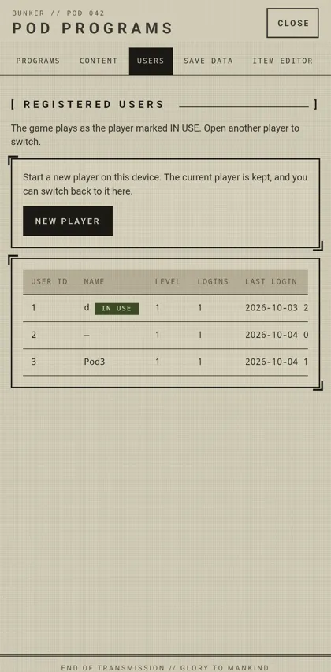
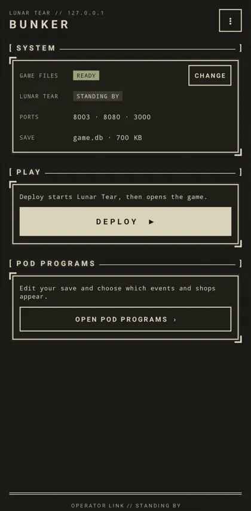
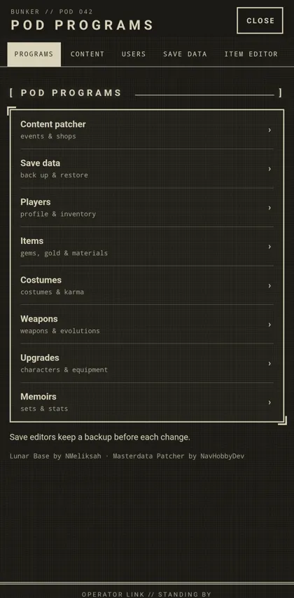
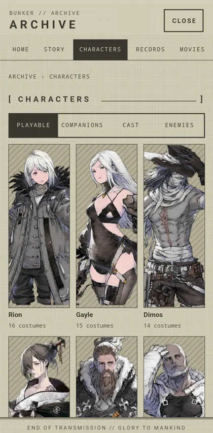
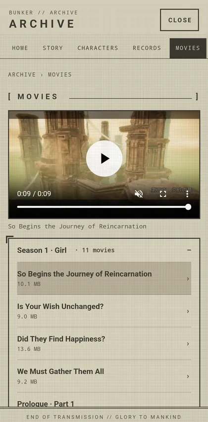
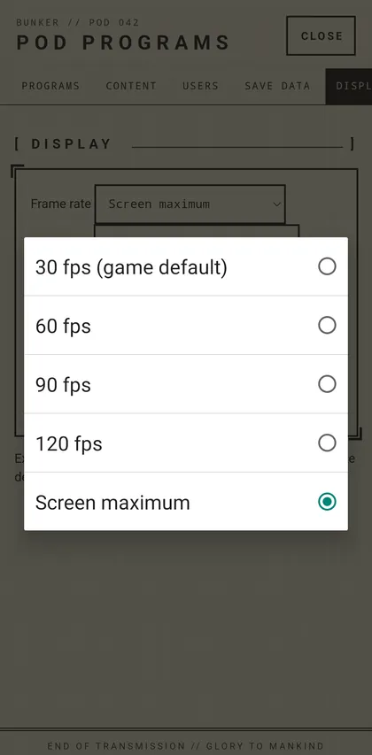

## AI usage disclosure

This is a **personal hobby project** built with extensive AI assistance from OpenAI Codex and Anthropic Claude for coding, integration, testing, and documentation. It is an unofficial, experimental project, not an official game release.

# Bunker

Run the game and its Lunar Tear server on the same phone or tablet, on Android or iOS. After setup, no computer connection or Internet is needed to play.

- **Android:** one APK with the launcher, server, content patcher and save editors.
- **iPhone and iPad:** one IPA with the server and launcher inside the game. See [iOS](docs/IOS.md).

## Features

- **Offline play.** The game and its Lunar Tear server run on the same device. After setup, it
  needs no computer or Internet connection, and in-game downloads load from the device, even in
  airplane mode.
- **The Bunker**, the launcher: imports the resource dump (`.7z`, `.zip` or an extracted folder,
  copied or used in place), starts Lunar Tear and opens the game, and checks that the game can
  reach it.
- **Pod Programs**, on the device:
  - **Content patcher**: events and shops, with presets and rollback.
  - **Save data**: automatic snapshots, backups and restore.
  - **Players**: choose which player the game signs in as, or start a new one.
  - **Editors**: items, costumes, weapons, companions, upgrades, memoirs and more.
  - **Summon rates**: the odds of the next summons.
  - **Display**: frame rate up to the screen's maximum refresh rate, and resolution up to the
    screen's own. Walking and battles keep their normal speed. Experimental: it uses more battery,
    and at 120 fps 1080p is easier on the GPU than the screen's own resolution.
- **Archive**, read from your game files: the whole story by season and chapter with who says
  each line, the records, every costume with its art, story and voice lines, 3D models with field
  and battle motions, the soundtrack, a gallery, the movies (full screen in landscape on Android,
  in the system player on iOS), and search. The game keeps running while it is open.
- **Missions**: daily, challenge, special and mission pass missions progress
  and pay their rewards (Lunar Tear left them at 0). Progress already in a save
  counts the first time. Also the daily quest set reward, skipping several
  quests at once, and story choices.
- **Arena**: battles against computer players on a ladder of 5,000, with decks
  raised to match yours. Points, grades, rank, win rewards, battle points,
  history, defense battles while you are away and weekly rewards. Opens after
  quest 61, as in the original. Season rewards are not paid: seasons never end.
- **Summon rates** (Pod Programs, experimental): the ★4 and ★3 rates, the
  costume and featured shares, the 10-draw guarantee and the multi-step boost;
  the game's Rates page shows them.
- **Summon details**: each banner's Details page lists its dates, cost,
  medal exchange, featured items and every item with its rate (names come
  from the Archive once it has been built).
- **Server fixes**: friend actions and other calls Lunar Tear did not answer
  no longer fail, and the shop's purchases add their items to the inventory.
  Reward icons that stayed blank after the game was closed mid-download are
  downloaded again.
- **Game Mode**: the app declares itself a game, so iOS Game Mode and Android's Game Mode and Game
  Dashboard apply.
- **Light and dark**: follows the device, or choose one in ⋮ → Display.

## Screenshots

| The Bunker (launcher) | Options menu | Pod Programs |
| :---: | :---: | :---: |
|  |  |  |
| **Players** | **The Bunker, dark** | **Pod Programs, dark** |
|  |  |  |
| **Archive: characters** | **Archive: movies** | **Display: frame rate** |
|  |  |  |

Light or dark follows the phone, or choose one in ⋮ → Display. Screenshots are from Android; iPhone and iPad look the same.

## Build in your browser

**[Open the web builder](https://veritr1x.github.io/bunker/)**: pick Android or
iPhone/iPad, choose your own game file and master data, and download the offline app. Everything
runs in your browser; your files are never uploaded. No tools to install.

Limitations:

- **You still need your own files**: the original 3.7.1 ARM64 APK or a decrypted 3.7.1 IPA, the
  `20240404193219.bin.e` master data, and the resource dump. Other versions are refused.
- **The Android APK is signed with a public key**, so it installs as it is, and every web build
  updates over the previous one. The key ([`web/signing/bunker-key.p12`](web/signing/bunker-key.p12),
  password and alias `bunker`) is public: anyone can sign a build that installs over yours. To
  avoid that, re-sign with your own key, and keep using that key for updates. An app signed with
  a different key has to be uninstalled first, which deletes its data.
- **The iOS IPA is unsigned.** Install it with Sideloadly or AltStore, or sign it with your own
  certificate. Keep the same bundle ID for updates.
- **Use a desktop browser** with about 2 GB of free memory. Phones may run out of memory.
- **The Android web build has no in-game Facebook account link**, because that patch needs a
  decompiler. Offline play, Pod Programs, the Archive and save backup and import all work. The
  iOS web build is the same as the command-line build.
- **Experimental: port offset.** If another app on the device already uses the game's local
  ports (8003, 8080 or 3000), the launcher says so; a build with a port offset moves all three.
- **The resource dump is not part of the build.** Put its `.7z` on the phone and choose it in
  the app, which unpacks only what the game uses, so on Android the whole flow works without
  a computer. Sideloading the IPA on iPhone and iPad usually needs a computer once.

To build everything locally instead, follow the step-by-step guide below.

## Play on Android

1. Install the APK, from the web builder or your own build.
2. Open it and tap **Choose** under **Game files**, then choose the resource dump's `.7z` or an extracted folder, to copy or use in place (a progress bar shows the time left).
3. Tap **Deploy**. The server starts and the game opens.

The Bunker opens on later launches and deploys the game by itself; tap the Lunar Tear notification
to return to it. **Open Pod Programs** and **Open Archive** sit on the Bunker; Pod Programs stops the
game while it is open, so close it and tap **Deploy** to resume. Tap **⋮** for save backup and
import, the Lunar Tear log and its export, Display (light/dark/system), settings, help and about.

## Play on iPhone or iPad

1. Install the IPA, from the web builder or your own build, signed with Sideloadly, AltStore or your own certificate.
2. Open it and tap **Choose** under **Game files**, then choose the resource dump's `.7z` or an extracted folder, to copy or use in place (a progress bar shows the time left).
3. The server starts and the game continues. Three-finger double-tap opens the launcher during play
   (⌘B with a keyboard).

Tap **⋮** for Lunar Tear control, master-data import, save backup and restore, the Lunar Tear log and its export, Display (light/dark/system), help and about. **Open Pod Programs** and **Open Archive** sit on the Bunker itself.

## Play on a Mac

The iPhone/iPad build runs natively on a Mac with Apple silicon (M1 or later), as an iPad app.
There is no Windows version: the game exists only as ARM code for Android and iOS. On Windows,
an Android emulator that runs ARM apps is the only option, and it is untested.

1. Sign the IPA with your own Apple developer team (see [iOS](docs/IOS.md#build)). The
   provisioning profile must include the Mac: add its **Provisioning UDID** (System Information ›
   Hardware) as a device. Sideloadly and AltStore install only on iPhone and iPad.
2. Build with a port offset. On a Mac the game shares ports with everything else, and port 3000
   in particular is often taken by development servers:
   ```sh
   python3.11 scripts/build.py --ipa ~/Downloads/com.square-enix.NieRSPww_3.7.1.ipa \
     --master ~/Downloads/20240404193219.bin.e --port-offset 30000 \
     --bundle-id <your bundle ID> --sign-identity <identity> --profile <profile>
   ```
   Keep the same offset for every update.
3. Double-click `artifacts/bunker.ipa`; macOS installs it into Applications as **NieR**.
4. Open NieR and click **Choose** under **Game files**, as on iPhone. The app can read only files
   you pick there.
5. **Bunker › Open Bunker** (⌘B) opens the launcher during play.

To update, quit NieR first and double-click the new IPA. If Applications then has more than
one NieR (for example **NieR 2**), keep the newest and move the others to the Trash; they share
the same data.

## Build it yourself, step by step

Everything below runs on your computer once. Playing needs only the phone or tablet.
Commands are for macOS with [Homebrew](https://brew.sh); Linux works for the Android build
with the same tools from your package manager.

### 1. Gather your own game files

None of these are included in this repository. Put them anywhere; the commands below use
`~/Downloads`.

| File | Needed for |
| --- | --- |
| Original game APK, version 3.7.1, ARM64 (`…nierspww_3.7.1…apk`) | Android |
| Decrypted game IPA, version 3.7.1 (`com.square-enix.NieRSPww_3.7.1.ipa`) | iPhone/iPad |
| Master data `20240404193219.bin.e` | both |
| Resource dump: `resource_dump_android.7z` and/or `resource_dump_ios.7z` | Android / iPhone/iPad |

### 2. Install the tools

Both platforms:

```sh
brew install git go protobuf python@3.11 sevenzip
```

For **Android**, also:

```sh
brew install apktool
```

Then install [Android Studio](https://developer.android.com/studio) and, in its SDK Manager,
add **Android SDK Platform 36**, **Build-Tools 36.0.0** and **NDK 27.2.12479018**. Use its
bundled JDK 21 (newer JDKs break the Android build):

```sh
export JAVA_HOME="/Applications/Android Studio.app/Contents/jbr/Contents/Home"
```

For **iPhone/iPad** (Mac only), also install Xcode from the App Store, open it once to finish
setup, then add Python 3.13 for the Tools runtime:

```sh
brew install uv
uv python install 3.13
```

### 3. Get the code

```sh
git clone --recurse-submodules https://github.com/veritr1x/bunker.git
cd bunker
```

If you cloned without `--recurse-submodules`, run `git submodule update --init --recursive`.

### 4. Build

Always run the build with `python3.11`. It checks its tools first and names anything missing.
The first build downloads dependencies and takes several minutes.

**Android:**

```sh
python3.11 scripts/build.py \
  --apk ~/Downloads/<original-game>.apk \
  --master ~/Downloads/20240404193219.bin.e
```

Result: `artifacts/bunker.apk`. The first build creates a signing key in
`inputs/lunar-local.keystore`. **Keep it:** later builds must use the same key to update the
app without losing its data.

**iPhone/iPad:**

```sh
python3.11 scripts/build.py \
  --ipa ~/Downloads/com.square-enix.NieRSPww_3.7.1.ipa \
  --master ~/Downloads/20240404193219.bin.e
```

Result: an unsigned `artifacts/bunker.ipa`. Install it with Sideloadly or
AltStore and your Apple ID, or sign it with your own Apple developer team as described in
[iOS](docs/IOS.md#build).

### 5. Get the game files onto the device (about 21 GB)

The simplest way is to copy the dump's `.7z` itself to the phone or tablet (step 6) and choose
it in the app. The app unpacks only `revisions/0`, which the game uses; the other 817 revisions
are 28 GB of old catalogs and are skipped. A `.zip` of the dump works too. Allow the archive's
size plus about 25 GB free while importing; you can delete the archive afterwards.

Alternatively, extract just that folder yourself:

```sh
# Android
7zz x ~/Downloads/resource_dump_android.7z 'revisions/0/*' -o"$HOME/Downloads/android-dump"

# iPhone/iPad
7zz x ~/Downloads/resource_dump_ios.7z 'revisions/0/*' -o"$HOME/Downloads/ios-dump"
```

or on the phone with an app such as ZArchiver. A full extraction also works, since the app
copies only revision 0, but it needs about 49 GB free while extracting.

Android and iOS files are not interchangeable; use the matching dump.

Optional: `python3.11 scripts/prepare_assets.py --source ~/Downloads/android-dump --output
phone-assets/android/assets` turns the extraction into a ready `assets` folder and checks it. Use
it when you copy files into the app with Finder, which skips the app's own import.

### 6. Install and play

**Android (9 or later, ARM64):**

1. Put `resource_dump_android.7z` (or the extracted folder) on the phone, for example in
   `Download`: with a USB cable, or `adb push ~/Downloads/resource_dump_android.7z /sdcard/Download/`.
2. Install the APK: open it on the phone, or run `adb install artifacts/bunker.apk`.
3. Open the installed app, tap **Choose**, then **Archive (.7z or .zip)** and pick the `.7z`, or
   **Extracted folder: copy into the app** and pick the folder containing `revisions`. It unpacks
   or copies revision 0 into the app; a progress bar shows the time left. You can delete the
   archive or folder afterwards.

   To save 21 GB, pick **Extracted folder: use in place** instead (Android 11 or later). The app
   asks you to turn on **All files access** for NieR in Settings once, then reads the folder where
   it is. Keep the folder there: if it is moved or deleted, choose it again.
4. Tap **Deploy**. The server starts on the phone and the game opens.

**iPhone/iPad (iOS 14 or later):**

1. Install the IPA (step 4).
2. Open **NieR**. The launcher appears because the game files are missing.
3. Under **Game files**, tap **Choose**, then **Archive (.7z or .zip)** and pick `resource_dump_ios.7z`, or an
   **Extracted folder** option and pick the extracted folder (the one
   containing `revisions`) from Files, iCloud Drive or a USB drive. Allow about 25 GB free besides
   the archive. A folder already inside NieR's own files (copied in with Finder) is moved
   instead of copied, which is instant. **Extracted folder: use in place** reads a folder
   elsewhere where it is: it needs no space, but the folder must stay there (and a USB drive
   must stay connected while you play). iCloud Drive folders can only be copied. Finder can also take a prepared `assets` folder (step 5):
   drag it onto NieR (your device › Files) and tap **Check again**.
4. The server starts inside the game. Three-finger double-tap opens the launcher during play
   (⌘B with a keyboard, or **Bunker › Open Bunker** on a Mac).

### 7. Update later

```sh
git pull
git submodule update --init --recursive
```

Then build again with the same command. On Android, the build reuses `inputs/lunar-local.keystore`
automatically. On iOS, sign with the same bundle ID. Either way, export a save backup from
**⋮** first; **⋮ → Import save backup** restores it, including on another device.

### Troubleshooting

| Message or symptom | Fix |
| --- | --- |
| `Missing <tool>` | Install it as in step 2; the build lists each missing tool. |
| Errors mentioning `filter` or `tarfile` | You ran `python3`; use `python3.11`. |
| Gradle or `jlink` fails | `JAVA_HOME` is not JDK 21; set it as in step 2. |
| `Missing the iOS SDK` | Install Xcode and open it once. |
| `Install Python 3.13` | Run `uv python install 3.13`. |
| The new APK will not install over the old one | It was signed with a different key. Build with `--keystore` pointing to your original key. |
| Android: loading waits for minutes (for example at 20% or 60%) or shows "Failed to connect", but works in airplane mode | A VPN, proxy or "network accelerator" app was intercepting the game's requests to its own server on the phone. Builds from 2026-10-03 on send those requests directly; rebuild, or turn the app off while playing. |
| "Port 8080 is already used by another app on this device…" (or 8003, 3000) | Another app holds one of the game's local ports. Close or uninstall it, or build with `--port-offset 30000` (or the web builder's experimental port offset) and keep using that offset for updates. ⋮ → **Check Lunar Tear** shows whether the game can reach its server. |
| Android: black screen after the logo when reopening the game from Recent apps (for example after an update) | The game was opened without its server. Builds from 2026-10-04 on go through the launcher, which starts the server first; with older builds, open the app from its icon. |
| Anything else | ⋮ → **Export Lunar Tear log** saves a ZIP of the Lunar Tear log (kept between sessions, up to about 10 MB) with the device model and OS version. Attach it to your report. On Android it is also at `Android/data/<package>/files/logs/` (`adb pull` works without root); on iOS, in the app's `logs` folder in Files. |
| Android 17: importing a `.7z` fails with `open /proc/self/fd/…: permission denied` | Fixed in builds from 2026-10-03 on; rebuild, or choose an extracted folder instead. |

More detail: [Android setup guide](docs/BUILD.md) and [iOS guide](docs/IOS.md).

## Pinned upstream projects

All four are Git submodules fixed to the tested commits. Both platforms build from these exact versions.

| Project | Pinned commit |
| --- | --- |
| [Lunar Tear](https://gitlab.com/walter-sparrow-group/lunar-tear) | `63df7d70556a7` |
| [Lunar Scripts](https://gitlab.com/walter-sparrow-group/lunar-scripts) | `942dced617ea` |
| [Lunar Base](https://github.com/NMeliksah/lunar-base) | `b39154099b8f` |
| [Master-data patcher](https://github.com/NavHobbyDev/lunar-tear-masterdata-patcher) | `9b6cd167b51d` |

Full pins: [upstream.lock.json](upstream.lock.json). Credits: [third-party notes](android/THIRD-PARTY.md).

## Status

iOS 14+ on iPhone and iPad: the opening story plays on an iPad Pro (M4), with the server running inside the game. Pod Programs and the Archive work there too, and the game runs at 120 fps with walking and battles at normal speed.

Android 9+ on ARM64. Offline opening gameplay, touch movement, content patching, save restoration and the Archive were tested on an Android 16 emulator; folder import with progress, save import and 120 fps play were tested on a Samsung Galaxy Z Fold, including a build from the web builder. Full campaign coverage is still pending. Missions, summon details and the Arena (a full battle and its rewards) were tested on the Android emulator; they are not yet tested on iPhone or iPad. See [validation](docs/VALIDATION.md).

